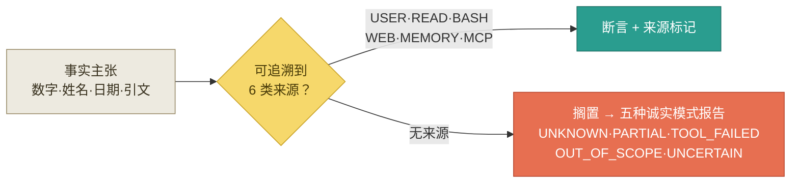
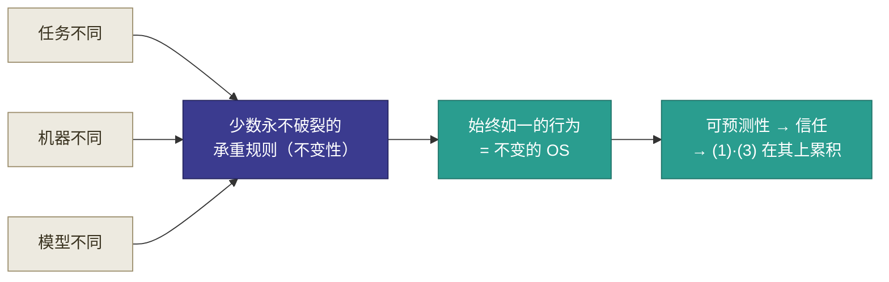
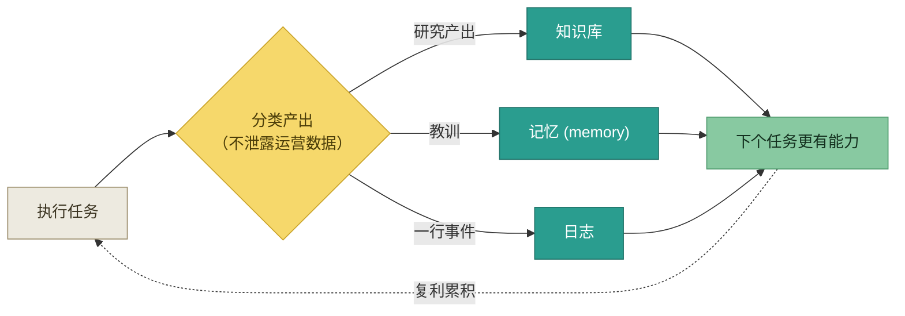
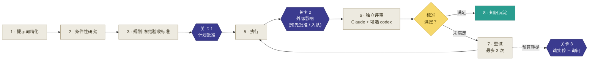

# W.A.Y? — Who Are You?（我不是开发者）

<p align="center">
  
</p>

[한국어](README.ko.md) | [English](README.en.md) | **中文**

   

**基于** [insane-search](https://github.com/fivetaku/insane-search) · [deep-research](https://github.com/fivetaku/gptaku_plugins) — 由 [fivetaku](https://github.com/fivetaku) 开发 (MIT) · 完整致谢见 [CREDITS.md](../../CREDITS.md)

> *"最个人的，就是最有创造力的。"* —— 马丁·斯科塞斯

我不是开发者，也不是编程专家。但我在策划领域工作，自认是个工作面铺得比较广的人。从去年起，
我一直追着 AI 圈里那些有名的人说的话跑，安德烈·卡帕西的 wiki、加里·谭的 gstack 等等，用过
很多名人的 harness、skills、loop，但那些都不是我自己的东西，正因为不是我的，也就很难做出我
想要的结果。

兜兜转转，到现在为止我得出的结论是：最个人化的，才是最有效的（就像马丁·斯科塞斯说的那样）。
每个人思考的方式、对 AI 说话的方式、期待得到的东西，从头到尾都注定各不相同。

所以我准备了这个——一套用来做出最个人化之物所需的工具包，以及一项确保最低限度稳定性的功能！
W.A.Y?（Who Are You?）框架会读取此前你在各自的 Claude 里积累下来的会话与记忆（memory），
推测你的工作方式、发言特征、期待的结果等，从而为你打造专属于你的框架——这是一套新手工具包。

我把自认为最该被守住的基本部分，结构化地准备了出来。其中包含 3 个核心概念、1 个核心工具
（/full-loop），以及 9 条最基础的理念。

即便是这样做好的工具包，终究也无法代表你本人。我建议你以它为基础，把更像你自己的环境，
精细而灵活地培育起来。

---

## W.A.Y? 强调的三件事

### (1) 确保可靠性：反幻觉 —— SVOP（Source-Verified Output Protocol，默认拒绝 default-deny）

每一项事实主张都必须可追溯到六类可信来源之一：**USER、READ（文件）、BASH（shell）、
WEB、MEMORY、MCP（外部系统）。** 其余一律不予断言——不会用一个自信的猜测把它抹平，
而是先搁置，再通过五种诚实模式（honesty mode）之一进行报告。不填空，不说"通常 / 也许"，
不合成用户似乎想要的答案。这条规则源自一次真实失败（一个金融机构识别码被幻化为貌似合理
却错误的编码），并由此推广开来：来源若为空，就如实说明，并指出尝试过哪些来源。



### (2) 一致性：永不破裂的核心结构（不变性）

这是框架的核心命题——规则越简明越强，但在任何情况下都不能破裂。少数永不破裂的承重规则，
强过众多会弯折的规则。因为结构在不同任务、机器与模型之间保持一致（不变性原则），框架便像
一个跨项目的*不变的 OS*那样运作。正是这种可预测性，构成了 (1) 反幻觉与 (3) 知识积累
每次都一致运作的根基。



### (3) 复利增长：不外泄的知识积累

每个任务都能让框架略微更有能力——研究产出归入正确的知识库，教训归入记忆，一行事件归入
日志——全程不泄露运营数据。框架随时间复利累积，绝不悄然覆盖耐久知识。



### +alpha 斜杠命令：/full-loop

以上三种特性是地基。**full-loop** 则是其回报——它将一条指令端到端地推进八个阶段，
仅在真正重要的人工关卡（human gate）处停下。见下文
["full-loop"](#full-loop--端到端end-to-end编排)。



---

## 理念

### 原则（P1–P6）

- **P1 Plan-First** —— 在预期结果被具体定义之前，任何工作都不开始。
- **P2 Sync-Before-Execute** —— 仅在用户与 AI 约 90% 对齐之后才开始执行。
- **P3 Plan–Execute Separation** —— 计划由人主导，执行由 AI 主导。绝不混淆。
- **P4 Immutability** —— 结构在不同环境与模型之间运行一致。
- **P5 Data-Driven Dependency** —— 仅当依赖带来新数据或新视角时才接受；拒绝单薄的
  提示词封装（wrapper）。
- **P6 Operational One-Way + Meta Feedback** —— 数据不外泄，教训得以汇集。

### 反原则（AP1–AP3）

声明什么 *不是* 原则，与声明什么是原则同样重要。

- **AP1 非确定性是一种特性** —— 同一输入产生不同输出是正常且受欢迎的；框架不抑制这种
  变动性。
- **AP2 显式性不是原则** —— 对每个输出的完全可审计并非目标；只保留用于元反馈的轻量
  日志，而非把验证负担转嫁给你。
- **AP3 不主动隔离数据** —— 没有基于时间或信号的自动衰减（auto-staling）。层级（tier）
  与信任度仅在新数据挑战旧数据时才变化（push 驱动）；AI 只提供分析，由你决定。

---

## 五种信任机制

| # | 机制 | 作用 |
|---|------|------|
| 1 | **Mode Toggle** | 将每个任务自动归类为事实优先 / 创作优先 / 混合（混合默认归入保守的 research），并调整验证的严格度。你的一行 override 即可切换。 |
| 2 | **来源抓取（fetch）策略** | 任何事实主张（数字、姓名、日期、专有名词、引文）都触发强制抓取，与 Mode 无关。来源优先级：USER → BASH → READ → MCP → WEB → MEMORY。无猜测回退。 |
| 3 | **五种诚实模式** | 抓取失败时，框架以 UNKNOWN、PARTIAL、TOOL_FAILED、OUT_OF_SCOPE 或 UNCERTAIN 报告，而非猜测——既在行内标注，也在答尾汇总。 |
| 4 | **Critical Path + Best-of-N** | 高风险工作（外部影响、下游自动化衔接、回退代价高，或你标注"重要"）强制 research 模式、强制抓取，以及 **Best-of-N 验证（N=3）**：3/3 一致 → 采纳；2/1 → 带不一致标记采纳；全部不同 → 搁置并征询你。 |
| 5 | **MCP 来源信任分级** | 外部系统数据分为 High / Medium / Low 三级。Medium 与 Low 必须标注来源（Low 还须注明原因）；冲突时同时呈现两个来源，若属 Critical 工作则汇入 Best-of-N。 |

详细规则位于 [`rules/`](../../rules/) 下：`mode-toggle.md`、`fetch-policy.md`、
`unknown-modes.md`、`critical-path.md`、`mcp-trust-levels.md`。

---

## 用户模型的演进

自我定义并非冻结。它通过四种机制演进，但仅在新数据挑战旧数据时——且实质性变更须经你
批准，绝无悄然的自我改写（与 AP3 一致）。

- **SDE（Self-Definition Extraction）** —— 读取你的上下文，连同置信度标记起草/更新
  五大领域模型的抽取器。
- **变更追踪** —— `self/changelog.md` 记录模型随时间的变化。
- **缺口追踪** —— `self/conflicts.md` 保存尚未解决的张力与待答问题，而不加以掩盖。
- **三层记忆** —— 已批准知识的晋升库：

| 层级 | 位置 | 访问 |
|------|------|------|
| Public | `memory/public/` | 显式调用（已晋升、已批准的知识） |
| Quarantine | `memory/quarantine/` | 仅显式调用 |
| Archive | `memory/archive/` | 仅显式调用，**绝不删除（never deleted）** |

MEMORY 来源的正本（canonical）是 CLI 内置的 auto-memory；框架的 `memory/` 层级是
通过批准之知识的晋升库。

---

## full-loop —— 端到端（end-to-end）编排

**full-loop** 接收一条自然语言指令，自主地推进八个阶段：

1. 提示词精化（结构化任务、归类意图、为模糊度评分）
2. 条件性市场/网络研究
3. 带冻结**验收标准（acceptance criteria）**的 plan 模式规划
4. **人工批准**（关卡）
5. 执行
6. 独立评审（Claude 评审，外加可选的异厂 codex 评审）
7. 有限重试 —— 至多 **三次** 尝试
8. 知识沉淀

三道人工关卡**绝不绕过**：

- **计划批准** —— 在执行前，由你批准计划（以及任何预先委派的外部行为）。
- **外部影响** —— 触及外部世界的行为（push、发送、API 调用）要么随计划预先批准，要么在
  循环继续运行期间入队延后，再在最终报告中决定。由工具级护栏强制执行，而不依赖模型自报。
- **重试耗尽** —— 若在预算内无法满足标准，则诚实停下并征询，而非宣布虚假的成功。

请用于多步骤工作 —— 研究 + 规划 + 构建 + 验证 —— 包括在人工关卡处暂停的无人值守夜间运行。
**不要**用于一行修复或一个快速提问。见
[`skills/07_orchestration/full-loop/SKILL.md`](../../skills/07_orchestration/full-loop/SKILL.md)。

> **计划独立公开发布（下一步工作）。** full-loop 将被拆分为独立的仓库，以便单独使用与
> 贡献。

---

## 如何开始

1. 克隆（clone）这个仓库。
2. 在 Claude Code 中运行 `sde-extractor`（或用 `/full-loop` 完成入门），它会读取你 CLI 里
   积累的会话与记忆（memory），为你起草一份 self-definition。
3. 审阅草稿并批准后，专属于你的框架便开始运转。

更详细的步骤见下文 [快速开始](#快速开始quick-start)与[入门指南](ONBOARDING.zh.md)，
更深入的背景见 [CONCEPT.zh.md](CONCEPT.zh.md)。

---

## 目录结构

| 路径 | 作用 |
|------|------|
| `CLAUDE.md` | 每个 AI 智能体在此开始工作时自动加载的基础指令 |
| `harness-blueprint.md` | 框架设计文档 |
| `self/` | 你的整合自我定义 + 变更/缺口/背景日志 |
| `memory/` | 三层记忆（public / quarantine / archive） |
| `rules/` | 详细运行规则（mode-toggle、fetch-policy、unknown-modes、critical-path、mcp-trust-levels、context-management、p6-log-anonymization） |
| `agents/` | 按任务类型划分的子智能体定义（+ INDEX、USAGE-GUIDE） |
| `skills/` | 可复用的技能模块（含 `sde-extractor`、`full-loop`）（+ INDEX、USAGE-GUIDE） |
| `decisions/` | 审批队列（`pending.md`）+ 归档 |
| `logs/` | operations / decisions / meta-feedback 日志 |
| `projects/` | 仅含各项目的元信息（真实运营数据存于外部仓库） |
| `_reference/` | 外部参考资料（用于引用/洞察，非用于执行） |
| `docs/i18n/` | 本地化 README（ko / en / zh） |

---

## 要求

| 要求 | 用途 |
|------|------|
| **Claude Code**（或任何能读取你的记忆、git 历史与设置的 CLI 智能体） | 运行框架与抽取步骤 |
| **git** | 克隆仓库；抽取器会读取你的提交节奏 |
| 可选插件：**insane-search**、**deep-research** | 更强的网络研究（自适应访问被封锁的来源、多来源事实核查） |
| 可选：**codex / GPT-5.5**（付费，可选启用） | full-loop 内部的异厂（cross-vendor）独立评审 |

只有前两项是必需的。其余一切均为可选启用，没有它们框架也能运行。

---

## 入门

### 快速开始（Quick Start）

```bash
# 1. 克隆框架
git clone https://github.com/Global-mindee/WAY.git
cd WAY

# 2.（可选）在 Claude Code 内安装网络研究插件
/plugin marketplace add github.com/fivetaku/gptaku_plugins.git
/plugin install insane-search@gptaku-plugins
/plugin install deep-research
/reload-plugins

# 3. 入门 —— 抽取器读取你的 CLI 记忆、git 与设置，
#    然后起草你的自我定义（self-definition）
run the sde-extractor

# 4. 审阅草稿，然后在 decisions/pending.md 中批准
#    （在你批准之前，不会应用任何实质性内容）
```

一份简短的清单 —— 克隆、（可选）安装插件（`insane-search`、`deep-research`）、运行
`sde-extractor`、审阅并批准你的自我定义，框架便已上线。每一步都会注明它所触及的文件。

完整指引：[`ONBOARDING.zh.md`](ONBOARDING.zh.md)。

---

## 使用示例

你用平实的语言来驱动框架 —— 没有特殊语法。几个常见的开场白：

- **端到端地执行某件事：** *"把这个 full-loop 一下"* / *"端到端跑完，只在关卡处问我"* ——
  启动八阶段自主循环，仅在计划批准、外部影响与重试耗尽处停下。
- **入门或重新入门：** *"运行 sde-extractor"* / *"重新读取我的记忆并更新我的自我定义"* ——
  从累积的上下文起草或刷新你的用户模型。
- **处理审批队列：** *"给我看看待批准的项目"* —— 呈现 `decisions/pending.md` 中等待的项目；
  你通过编辑该文件来批准。
- **带来源的深度研究：** *"带引用调研 X"* —— 扇出网络搜索、验证主张，返回一份带引用的报告而非猜测。

---

## 第三方来源

W.A.Y? 立足于他人的工作 —— 可选的 `insane-search`、`deep-research` 插件（fivetaku，
MIT / 上游），可选的异厂 codex / GPT-5.5 评审器（OpenAI，付费，可选启用），以及
insane-search 自身的依赖。完整署名与许可证：[`CREDITS.md`](../../CREDITS.md)。

许可证：MIT —— 见 [`LICENSE`](../../LICENSE)。
